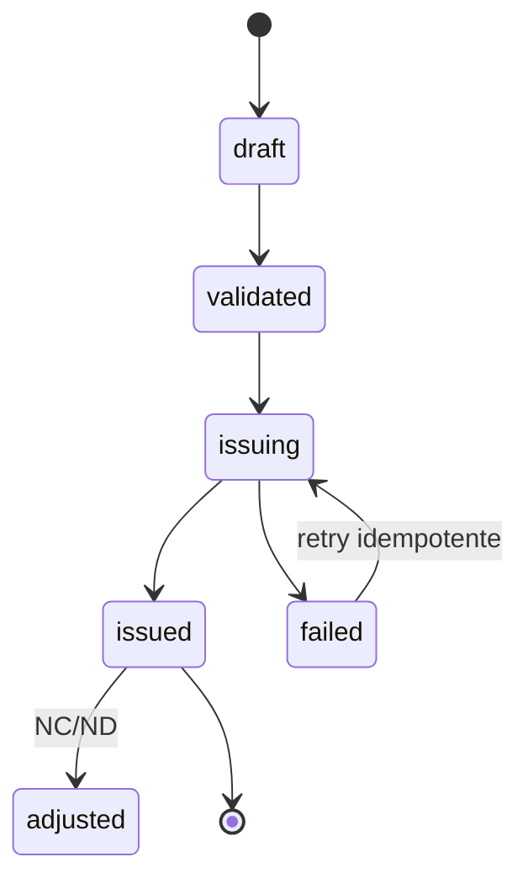

# Especificación de documentos fiscales

## Tipos
- Factura.
- Nota de crédito.
- Nota de débito.
- Orden de entrega.
- Guía de despacho.
- Comprobante de retención.

## State machine

## Prohibiciones
- `issued -> draft`: imposible.
- editar importe/RIF/items de `issued`: imposible.
- delete físico: imposible.

## Identidad fiscal congelada
Al emitir se copia snapshot de:
- razón social;
- RIF;
- domicilio;
- datos cliente;
- líneas;
- tasas;
- moneda/tasa;
- serie/secuencia;
- imprenta digital;
- versión fiscal del software.

## Numeración
- servicio de secuencia transaccional;
- unicidad por empresa/tipo/serie;
- nunca reciclar números emitidos;
- gaps deben ser explicables por evento/estado si la normativa/proveedor los permite.

## Integración
La respuesta de imprenta se guarda sin sobrescribir:
- request hash;
- response hash;
- timestamp;
- external id;
- control number;
- status;
- retries.

## Criterios de aceptación
- 100 reintentos de una misma idempotency key producen un solo documento.
- modificación SQL del payload emitido es bloqueada o detectada por integridad.
- NC referencia documento original.
