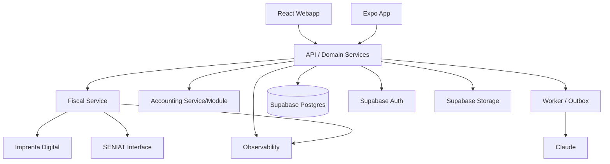

# Arquitectura

## Estilo
Modular monolith inicial con fronteras estrictas; extraer `fiscal`/`worker` como servicios cuando convenga.

## Por qué no microservicios completos desde día 1
La consistencia contable/inventario requiere transacciones coordinadas. Un modular monolith reduce complejidad y deja bounded contexts claros.

## Fiscal service
Debe tener:
- contrato versionado;
- release id;
- migrations compatibles;
- adapters;
- audit;
- feature flag de versión homologada.
