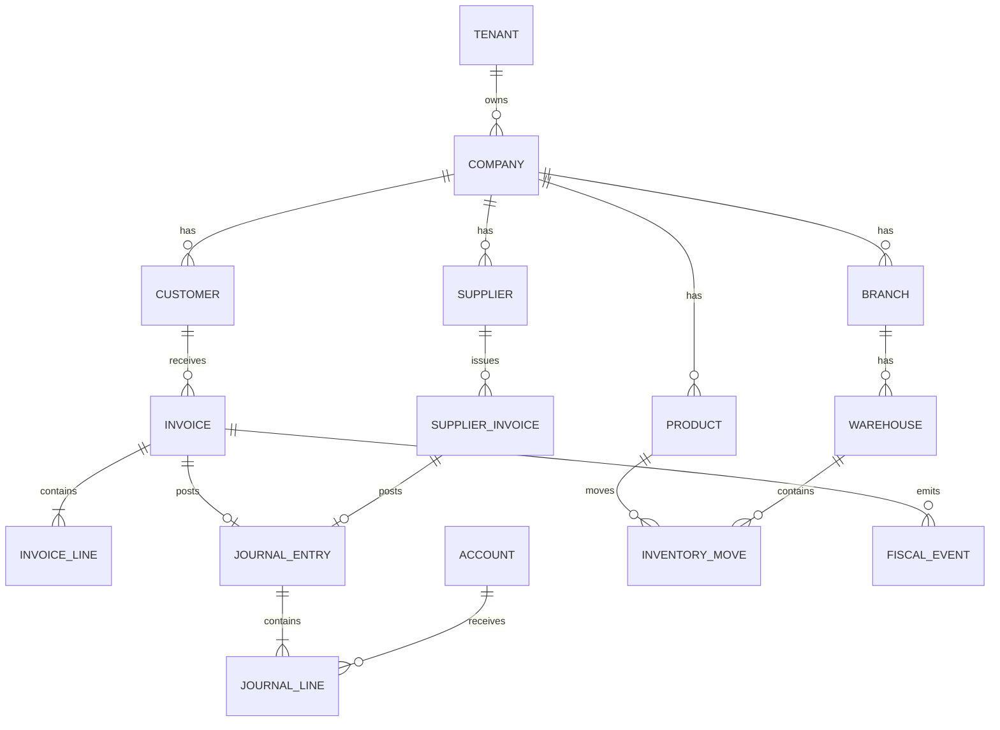

# Esquema de base de datos

## Dominios principales

## Convenciones
- `id uuid`.
- `tenant_id`.
- `company_id`.
- `created_at timestamptz`.
- `created_by`.
- `version bigint` para optimistic concurrency donde corresponda.
- `numeric(24,8)`.

## Tablas append-only
- journal_lines una vez posted;
- inventory_moves;
- fiscal_events;
- audit_events;
- payment_ledger.

## Particionado futuro
Por `company_id`/fecha en eventos de alto volumen si métricas lo justifican.
